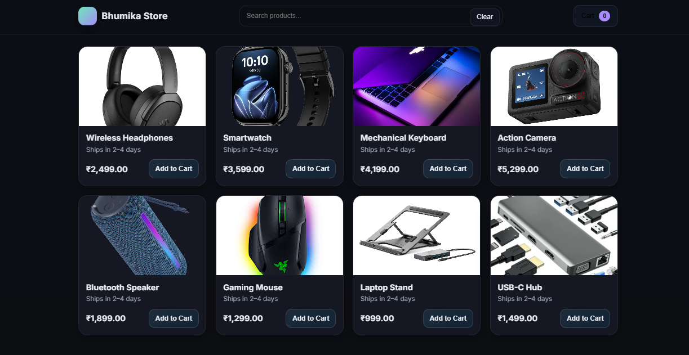

# 🛒 Bhumika Store

**Shop smart, shop easy!**  
A stylish and minimal e-commerce front-end built with HTML, CSS, and JavaScript. Browse products, add them to your cart, and enjoy a smooth shopping experience.  

🚀 **Live Demo**: [codebybhumika.github.io/Bhumika-Store](https://codebybhumika.github.io/Bhumika-Store/)

---

## ✨ Features
- 📦 Product showcase with images, names & prices  
- 🛒 Interactive **Cart System**  
- 💰 Real-time total price calculation  
- 🎨 Simple, clean, and responsive UI  

---

## 🛠️ Built With
- HTML5  
- CSS3  
- JavaScript (ES6)  
- Hosted via **GitHub Pages**  

---

## 📸 Preview
  
  

> _"Because shopping should always feel this easy!"_  

---

## 📁 Project Setup
Clone the repo and open `index.html` in your browser:

```bash
git clone https://github.com/CodeByBhumika/Bhumika-Store.git
cd Bhumika-Store
open index.html
